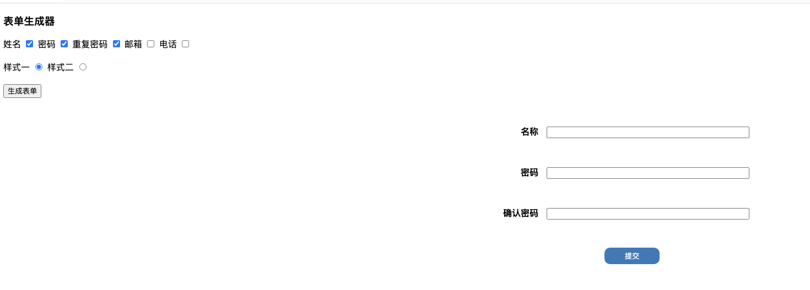
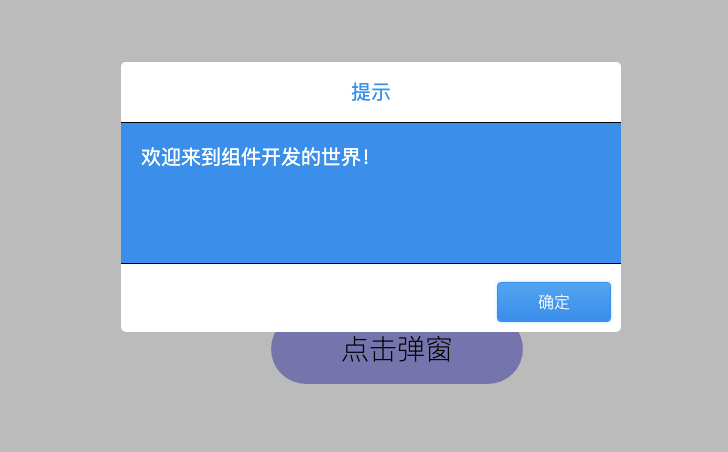
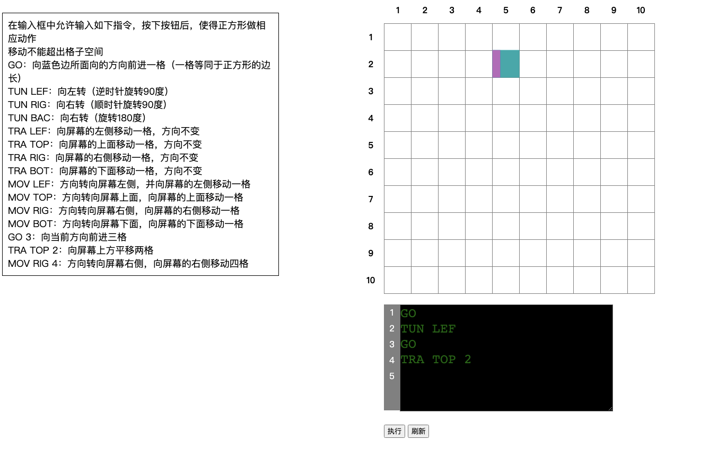
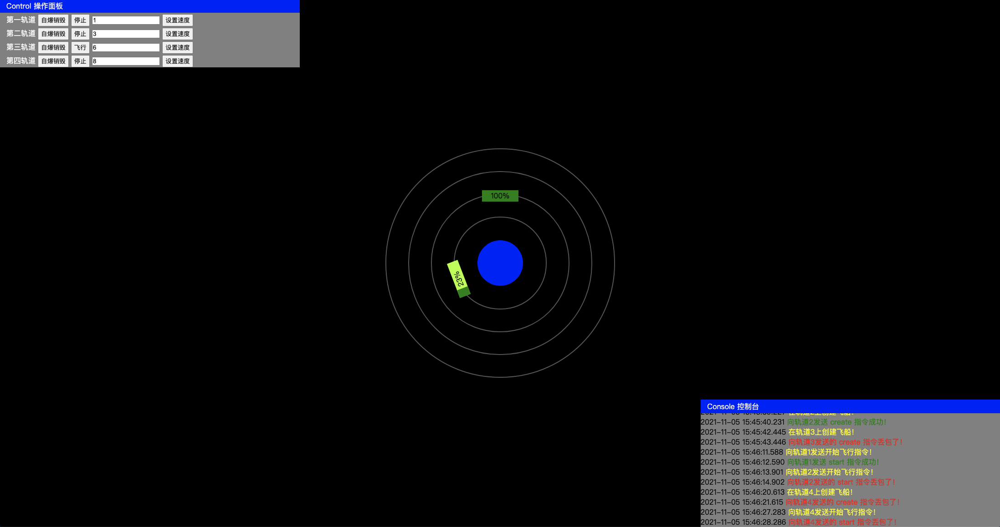
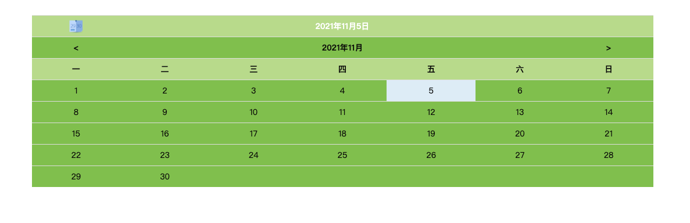
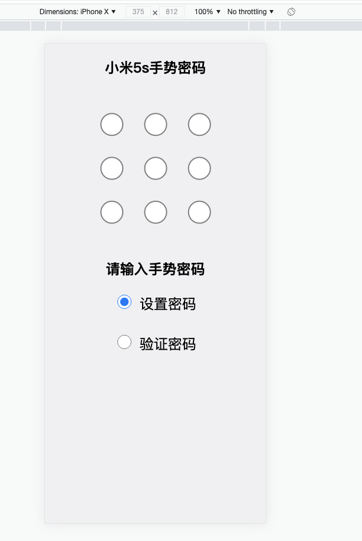

# tangzhirong.github.com
初学前端时写的几个小项目

# 在线地址
https://tangzhirong.github.io/

# 项目介绍

- 复杂首页（html5语义化，css布局与特效）

  

    
- 表单工厂（设计模式之单例模式）

  

- 浮出层组件（事件绑定，事件委托）

  

- 听指令的小方块（原型链，面向对象编程，dom操作）

  

- 行星与飞船（模块化，高内聚低耦合，设计模式之观察者模式）

  

- 日历组件（基本数据结构与算法）

  

- 轮播图组件（组件协议设计，易用性与扩展性）

  

- 移动端手势密码组件（移动端适配，canvas作图，触摸滑动效果优化）

  

